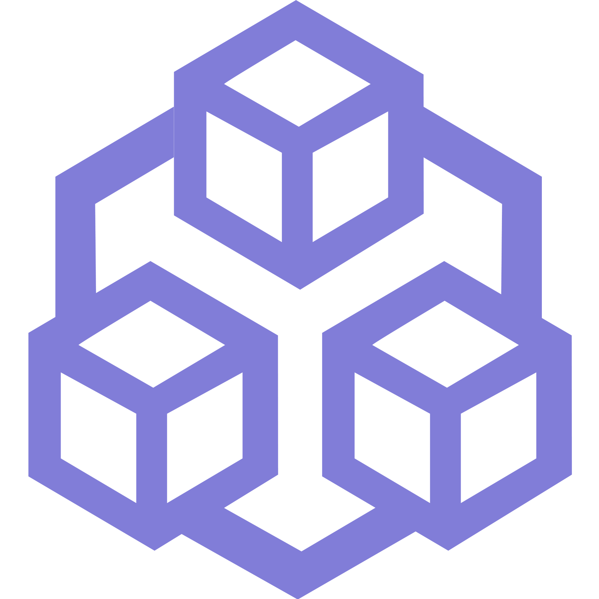

# Qryptic [](https://github.com/qryptic/qryptic/issues) [](https://github.com/qryptic/qryptic/pulls) [](https://github.com/qryptic/qryptic/graphs/contributors) [](https://github.com/qryptic/qryptic/blob/main/LICENSEs)

Qryptic is a desktop client to get real time market data of different crypto currencies.

## Table of Contents

- [Development resources](#development-resources)
- [Technologies](#technologies)
- [Translations](#translations)
- [Compiling Qryptic from source](#compiling-qryptic-from-source)
    - [Dependencies](#dependencies)
- [Contribute](#contribute)
    - [Pull Request](#pull-request)
    - [Donate](#donate)
- [Contributors](#contributors)
- [License](#license)


## Development Resources

- Web: qryptic.net
- Mail: mjovanc@protonmail.com
- GitHub: https://github.com/qryptic
- Hugin: qryptic board on Hugin Messenger
- It is HIGHLY recommended to join our board on Hugin Messenger if you want to contribute to stay up to date on what is happening on the project.

## Technologies

The API is built using:

- C++17
- CMake
- Qt 6
- QML
- Boost
- Google Test

## Translations

If you are interested in doing some translations for our application, please join our Hugin channel and talk to us. See more information in the [Development Resources](#development-resources) section.

## Compiling Qryptic from source

### Dependencies

The following table summarizes the tools and libraries required to build.

| Dep          | Min. version  | Vendored | Debian/Ubuntu pkg    | Arch pkg     | Void pkg           | Fedora pkg          | Optional | Purpose         |
| ------------ | ------------- | -------- | -------------------- | ------------ | ------------------ | ------------------- | -------- | --------------- |
| GCC          | 11             | NO       | `build-essential`    | `base-devel` | `base-devel`       | `gcc`               | NO       |                 |
| CMake        | 3.18           | NO       | `cmake`              | `cmake`      | `cmake`            | `cmake`             | NO       |                 |
| Boost        | 1.79          | NO       | `libboost-all-dev`   | `boost`      | `boost-devel`      | `boost-devel`       | NO       | C+


### Cloning the repository

Clone recursively to pull-in needed submodule(s):

```
git clone --recursive https://github.com/qryptic/qryptic
```

If you already have a repo cloned, initialize and update:

```
cd qryptic && git submodule init && git submodule update
```

*Note*: If there are submodule differences between branches, you may need 
to use `git submodule sync && git submodule update` after changing branches
to build successfully.

### Build instructions

Todo...

## Contribute

If you would like to contribute to this project there is two ways:

- Send a pull request
- Donate to our BTC/ETH address

### Pull Request

We appreciate all contributions whether it be small changes such as documentation of source code to major improvement of code. The easiest way is to make a fork and then make a pull request into our develop branch. To make the PR go through make sure to include this information:

```
What does this PR do?

Why are these changes required?

This PR has been tested using (e.g. Unit Tests, Manual Testing):

Extra details?
```

**NOTE:** If you want to a major contribution of code make sure to first send pull request to the diagrams submodule repo so we can review it before so we all can avoid spending uncessary time reviewing or coding if we decide it should be designed slight differently. 

### Donate

BTC: bc1ql97dlhhexma7agkk7gmg76t7ljycuqc9xgr4vl

ETH: 0x03A049028B673Cc5EF676695f442eC5614877335

## Contributors

The following contributors have either helped to start this project, have contributed
code, are actively maintaining it (including documentation), or in other ways
being awesome contributors to this project.

[](https://github.com/mjovanc)

## License

The license is GPLv3.
